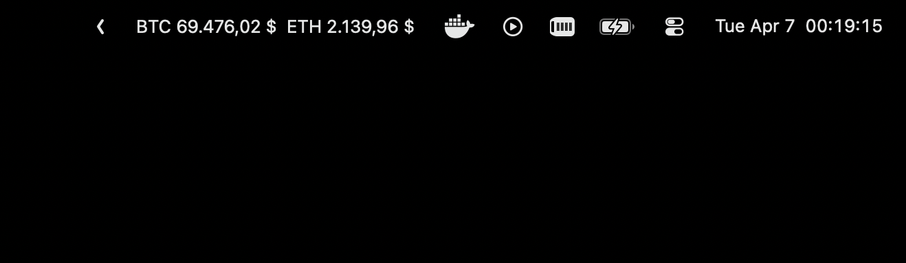

# Coinbar

Minimal macOS menu bar app that shows live Binance prices for a few tokens.

## Screenshot



## What it does

- Connects to Binance combined websocket streams
- Shows BTC, ETH, and SOL in a menu bar extra
- Reconnects automatically if the websocket drops
- Lets you change tracked symbols from the menu and persists them locally

## Run

```bash
swift run
```

The app launches as a menu bar extra and stays out of the Dock.

## Customize tokens

Use the `Symbols` button in the popup and enter one Binance symbol per line, for example:

```text
BTCUSDT
ETHUSDT
SOLUSDT
```

Selections are stored in `UserDefaults`.
